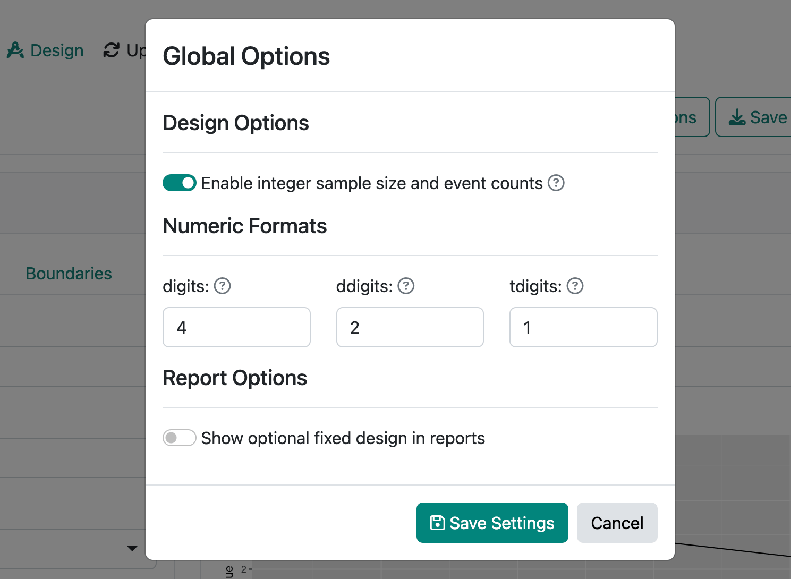

```{r setup, include=FALSE}
knitr::opts_chunk$set(echo = TRUE)
```

```{css, echo=FALSE}
img {
  border: 1px solid #ccc;
  border-radius: 6px;
}
```

We are thrilled to announce the release of [gsDesign](https://keaven.github.io/gsDesign/) 3.6.0.
gsDesign makes it easy to create group sequential clinical trial designs in R.
gsDesign also offers a [web interface](https://rinpharma.shinyapps.io/gsdesign/)
to enable both design creation/updates without coding and code generation
to reproduce the design.

You can install gsDesign from CRAN with:

```r
install.packages("gsDesign")
```

## What's new in gsDesign 3.6.0

### Time-to-event endpoint design with calendar timing of analyses

We added a [`gsSurvCalendar()`](https://keaven.github.io/gsDesign/reference/gsSurvCalendar.html)
function to enable group sequential design for time-to-event outcomes
using calendar specification of interim analysis timing.
These designs can use either information- or calendar-based spending with latter
focused on trials where the priority may be on finishing in a fixed time
rather than a fixed number of endpoints.

### Integer sample size and event count

[`toInteger()`](https://keaven.github.io/gsDesign/reference/toInteger.html):
Fixed the documentation and execution based on the `ratio` argument.

[`print.gsSurv()`](https://keaven.github.io/gsDesign/reference/nSurv.html):
Improve the display of targeted events (very minor).
The boundary crossing probability computations did not change.
The need for this was made evident by the addition of the `toInteger()` function.

### Translate survival design bounds to exact binomial bounds

[`toBinomialExact()`](https://keaven.github.io/gsDesign/reference/toBinomialExact.html) and
[`gsBinomialExact()`](https://keaven.github.io/gsDesign/reference/gsBinomialExact.html):
fixed error checking in bound computations, improved documentation and error messages.

Breaking change: [`gsSurv()` and `nSurv()`](https://keaven.github.io/gsDesign/reference/nSurv.html)
have updated default values for `T` and `minfup` so that function calls
with no arguments will run.
Legacy code with `T` or `minfup` not explicitly specified could break;
this was considered unlikely to be common and the new defaults offer some convenience.

### Other improvements

These vignettes were updated:

- [Vaccine efficacy trial design](https://keaven.github.io/gsDesign/articles/VaccineEfficacy.html).
- [Poisson mixture model](https://keaven.github.io/gsDesign/articles/PoissonMixtureModel.html).
- [Integer sample size and event counts](https://keaven.github.io/gsDesign/articles/toInteger.html).

We added an [`as_rtf()`](https://keaven.github.io/gsDesign/reference/as_rtf.html)
method for `gsBinomialExact` objects,
enabling RTF table outputs for standard word processing software.

For more details about the updates in gsDesign 3.6.0, see the
[changelog](https://keaven.github.io/gsDesign/news/).

## gsDesign Shiny app 2023.11.0

The [Shiny app for gsDesign](https://rinpharma.shinyapps.io/gsdesign/)
has been updated to 2023.11.0, working together with gsDesign 3.6.0.
This version supports the new key features added in gsDesign 3.5.0 and 3.6.0.
This update is also backward compatible, meaning restoring previously saved
designs will work consistently.

### Integer sample size and event count

The app now defaults to translating group sequential design to
integer events (survival designs) or sample size
(other designs except information-based designs).

To change this behavior:

1. Click **Global Options** in the upper-right corner.
2. Switch off **Enable integer sample size and event counts**.
3. Click **Save Settings**.

```{r, echo=FALSE}

```

The value of this new option will be saved when you save the design to
the `.rds` file. For reproducibility, restoring previously saved designs
will have this option switched off by default.

### Calendar-based timing and spending

New options have been added to allow calendar-based timing and spending when
creating the design.

**Calendar-based timing**:

1. Under the **Design** page, switch to the **Timing** tab.
2. In **Timing type**, select **Calendar-based**.
3. Fill out the **Calendar timing increments**.

```{r, echo=FALSE}
knitr::include_graphics("images/calendar-timing.png")
```

**Calendar-based spending**:

1. Under the **Design** page, switch to the **Boundaries** tab.
2. In **Spending type**, select **Calendar-based**.

Note that these options will only show up when the endpoint type is
time-to-event, and when the option under **Enrollment** is
**Vary enrollment rate (Lachin-Foulkes)**.

```{r, echo=FALSE}
knitr::include_graphics("images/calendar-spending.png")
```

### UI and report template improvements

We improved many theming details of specific UI elements in this release.
For example, the **Restore Design** button now renders properly under Firefox.
The padding of code blocks has been increased. The editing experience of
matrix inputs is now better aligned with numeric or select inputs.

Last but not least, the R Markdown report templates now load ggplot2 explicitly.
This is due to the dependency being moved from `Depends` to `Imports`
since gsDesign 3.4.0 ([#56](https://github.com/keaven/gsDesign/issues/56)).
