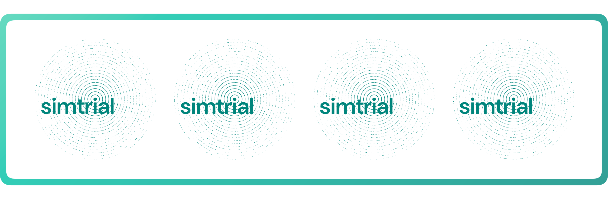
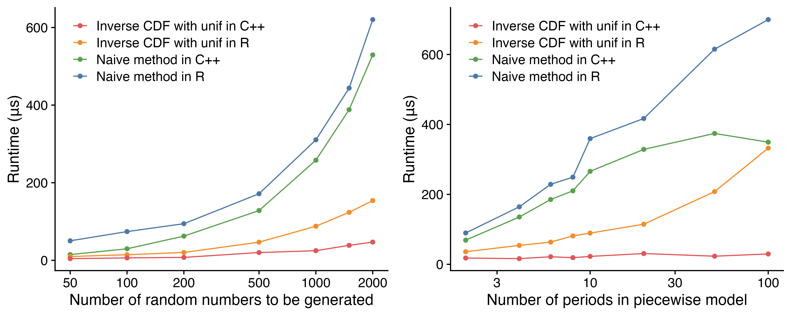

```{r setup, include=FALSE}
knitr::opts_chunk$set(echo = TRUE)
```

```{r, echo=FALSE}

```

We are excited to announce the first release of
[simtrial](https://merck.github.io/simtrial/) on CRAN.
simtrial is a fast and extensible clinical trial simulation framework
for time-to-event endpoints.

You can install simtrial from CRAN with:

```r
install.packages("simtrial")
```

## A clinical trial simulation framework

simtrial is intended to be a general purpose tool for simulating fixed,
group sequential, or adaptive clinical trials. There are several design
principles for the framework to create a coherent workflow while
allowing maximum flexibility:

- It supports stratified populations and flexible parameters for generating
  enrollment, event times, and dropout times.
- It takes care of bookkeeping to enable easily going from data generation
  to creating analysis datasets for evaluation of standard or innovative designs
  and testing procedures.
- For a single endpoint, it will easily generate trials with multiple arms
  (for example, a single or multiple experimental arms versus a common control)
  and multiple study populations (for example, overall population and biomarker positive).
- While tools are built into the package for logrank and weighted logrank tests,
  arbitrary testing and estimation procedures are easily applied. In addition to
  weighted logrank tests, it supports combinations of weighted logrank tests
  (for instance, the [MaxCombo test](https://doi.org/10.1080/19466315.2019.1697738)).
- The package uses piecewise constant enrollment, failure and dropout rates as
  a simple model able to approximate arbitrary distributions easily.
- This model also enables simulating **non-proportional hazards** assumptions
  that are transparent for users to explain to non-statistical collaborators.

## What's new in simtrial

The initial development of simtrial started in 2018. It was open sourced on GitHub
in 2021. In 2022 and 2023, it has gained substantial enhancements for a consistent,
modern API style and much faster simulation speed.

Since many users may have used the development version of simtrial from GitHub
before this first CRAN release, we will summarize the most important updates below.
For a comprehensive list of the recent updates, see the
[changelog](https://merck.github.io/simtrial/news/).

### Blazingly fast simulation with data.table

simtrial is designed with a core philosophy of basing most computations on
efficient table transformations and to have a package that is easy to qualify
for use in regulated environments.

Thanks to the contribution from [@jdblischak](https://github.com/jdblischak),
we have rewritten the tabular data processing engine for simtrial using [data.table](https://rdatatable.gitlab.io/data.table/).
This helps us achieve a 3x to 5x speedup compared to the previous
implementation on average---meaning the difference between getting the answer
after an entire work week versus one work day for large-scale simulations.

Figure 1 shows the speedup for 10k simulations for a fixed sample size design
using `sim_fixed_n()`, with the total sample size being 3,000 per simulation
and the targeted event count for analysis being 700.
The speedup folds as the number of CPU cores increases are highly consistent
until 16 cores, where the data.table version is so fast that the parallelization
overhead cannot be ignored anymore.

```{r}
#| echo=FALSE,
#| fig.cap="Comparison of runtime and speedup, highlighting the impact of different table backend types and parallel thread numbers. The y-axis is on a log10 scale, demonstrating consistent time saving and speedup."
knitr::include_graphics("images/table-backend-benchmark.png")
```

Even better, this backend change does not require the user to know data.table
at all. All the input and output data is still kept as a base R data frame so
you can use your favorite tools to prepare and summarize them.

### Adopting a modern parallelization solution

The fixed sample size design simulation function
[`sim_fixed_n()`](https://merck.github.io/simtrial/reference/sim_fixed_n.html)
now utilizes the [`%dofuture%` operator](https://www.jottr.org/2023/06/26/dofuture/) for parallelization.
This change not only increases the flexibility for using any compatible
parallelization backend, but also enhances the reproducibility by
using parallel-safe random number generators.
Check out the [new vignette](https://merck.github.io/simtrial/articles/parallel.html)
that demonstrates the parallelization workflow and coding best practices.
These improvements were contributed by [@cmansch](https://github.com/cmansch).

### Accelerated piecewise exponential distribution

The piecewise exponential distribution function
[`rpwexp()`](https://merck.github.io/simtrial/reference/rpwexp.html)
now adopts the inverse CDF method for random number generation.
Although this method will not generate bitwise reproducible numbers as the
"naive" method, they will still be
[matching stochastically](https://github.com/Merck/simtrial/issues/168).
This function is also written in C++ to ensure optimal performance,
contributed by [@jianxiaoyang](https://github.com/jianxiaoyang).
Figure 2 shows the scaling patterns of the implementations using
different methods and different languages.

```{r}
#| echo=FALSE,
#| fig.cap="Scaling of different `rpwexp()` implementations. The C++ implementation of the inverse CDF method scales the best when number of observations or the number of time periods increases."

```

### A consistently styled API

This release introduces significant changes to the API.
The user-visible changes include:

- Function and argument names now use snake case for consistency and readability.
  This aligns with the code style of [gsDesign2](https://merck.github.io/gsDesign2/).
  The dataset names are also updated to use snake case.
  See the [function reference](https://merck.github.io/simtrial/reference/) for details.
- The base pipe operator is now used throughout the package. The magrittr pipe
  is no longer re-exported. If you have legacy code that generates an error on
  "could not find function `%>%`", you can either load magrittr explicitly, or
  change the pipe operator to `|>`. Of course, this requires R >= 4.1.0.

### New functions for zero early weight and analysis date

This version also has important new functions contributed by
[@LittleBeannie](https://github.com/LittleBeannie):

- [early_zero_weight()](https://merck.github.io/simtrial/reference/early_zero_weight.html)
  is added as a weighting function for early data removal.
- [get_analysis_date()](https://merck.github.io/simtrial/reference/get_analysis_date.html)
  is added to calculate interim or final analysis dates under various conditions.

## Questions and feedback

We welcome your questions and feedback. Please feel free to
[raise an issue](https://github.com/Merck/simtrial/issues) on GitHub or
share this post with colleagues who might find simtrial valuable.
